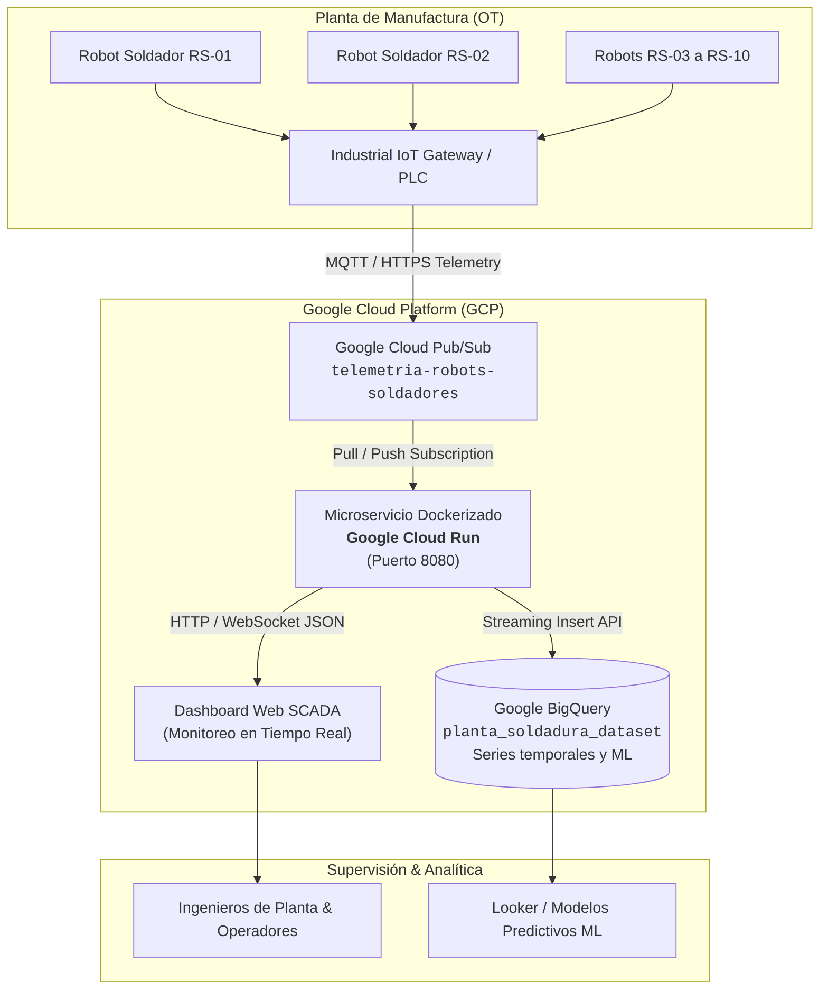

# Sistema de Monitoreo de Robots Soldadores - Industria 4.0

Aplicación web industrial ejecutiva para el monitoreo y supervisión en tiempo real de celdas de soldadura automatizada en plantas de manufactura inteligente.

---

## 🏗️ Arquitectura Cloud & IoT Objetivo



---

## 🐳 Dockerización & Ejecución Rápida

La aplicación está completamente dockerizada, optimizada en tamaño (< 50MB) y lista para producción y Google Cloud Run.

### 1. Prerrequisitos
- [Docker Desktop](https://www.docker.com/products/docker-desktop/) (o Docker Engine en Linux).
- Google Cloud SDK (`gcloud`) para despliegue en la nube.

### 2. Ejecutar con Docker Compose (Recomendado)
```bash
# Iniciar el servicio en segundo plano
docker compose up -d --build

# Verificar el estado y health check
docker compose ps

# Ver logs en tiempo real
docker compose logs -f
```
Accede al sistema en: **[http://localhost:8080](http://localhost:8080)**  
Health check: **[http://localhost:8080/health](http://localhost:8080/health)**

Para detener:
```bash
docker compose down
```

### 3. Construcción y Ejecución Manual con Docker CLI
```bash
# Construir la imagen optimizada
docker build -t scada-robots-monitor:1.0.0 .

# Ejecutar el contenedor en el puerto 8080 con reinicio automático
docker run -d \
  --name scada_robots_monitor \
  -p 8080:8080 \
  --restart unless-stopped \
  --env-file .env \
  scada-robots-monitor:1.0.0
```

### 4. Despliegue en Google Cloud Run
```bash
# 1. Autenticar en GCP y configurar proyecto
gcloud auth login
gcloud config set project TU_PROJECT_ID

# 2. Habilitar APIs necesarias
gcloud services enable run.googleapis.com artifactregistry.googleapis.com pubsub.googleapis.com bigquery.googleapis.com

# 3. Crear repositorio en Artifact Registry
gcloud artifacts repositories create smart-factory-docker-repo \
  --repository-format=docker \
  --location=us-central1 \
  --description="Imágenes Docker para Monitoreo de Robots"

# 4. Construir y subir imagen a Artifact Registry usando Cloud Build
gcloud builds submit --tag us-central1-docker.pkg.dev/TU_PROJECT_ID/smart-factory-docker-repo/scada-robots-monitor:1.0.0 .

# 5. Desplegar en Cloud Run con puerto 8080 y escalabilidad automática
gcloud run deploy scada-robots-monitor \
  --image us-central1-docker.pkg.dev/TU_PROJECT_ID/smart-factory-docker-repo/scada-robots-monitor:1.0.0 \
  --platform managed \
  --region us-central1 \
  --allow-unauthenticated \
  --port 8080 \
  --memory 256Mi \
  --cpu 1 \
  --min-instances 1 \
  --max-instances 10 \
  --set-env-vars "NODE_ENV=production,GCP_PROJECT_ID=TU_PROJECT_ID"
```

---

## 📊 Colección / Tabla: "Robots Soldadores"

La aplicación cuenta con una colección completa de **10 robots industriales** con los siguientes campos normalizados:

| Campo | Tipo de Dato | Descripción |
|---|---|---|
| **ID_Robot** | Texto | Identificador único del brazo robótico (ej. `RS-01` a `RS-10`) |
| **Area** | Texto | Celda o línea de ensamble asignada (`Soldadura Línea A`, `B`, `C`, `D`) |
| **Estado** | Texto | Estado operativo (`Activo`, `Detenido`, `Mantenimiento`) |
| **Temperatura** | Número | Temperatura instantánea en la antorcha (°C) |
| **Corriente** | Número | Corriente eléctrica del arco de soldadura (A) |
| **Horas_Operacion** | Número | Horas de servicio acumuladas (hrs) |
| **Alarma** | Texto | Condición de falla o diagnóstico (`Ninguna`, `Sobrecalentamiento (>400°C)`, etc.) |
| **Fecha_Actualizacion** | Fecha y Hora | Marca temporal de la última lectura (`YYYY-MM-DD HH:mm:ss`) |

---

## 🛠️ Módulos del Sistema SCADA

1. **KPIs Ejecutivos en Pantalla Principal**: Total de Robots, Robots Activos, Robots Detenidos y Alarmas Activas.
2. **Sección: Análisis Operativo (Gráficas en Tiempo Real)**: Temperatura por Robot, Corriente por Robot, Distribución del Estado y Tendencia de Temperatura en el tiempo.
3. **Módulo de Alertas Industriales**: Reglas automatizadas (>400°C Crítica Roja, >140A Advertencia Amarilla, Detenido Alerta Mantenimiento, Mantenimiento Informativa Azul).
4. **Pantalla Ejecutiva de Reportes**: 6 KPIs gerenciales, 4 gráficas analíticas, filtros multidimensionales y exportación a PDF y Excel.
5. **Health Checks y Resiliencia**: Endpoint `/health` para monitorización de uptime, memoria y estado operativo del contenedor.
